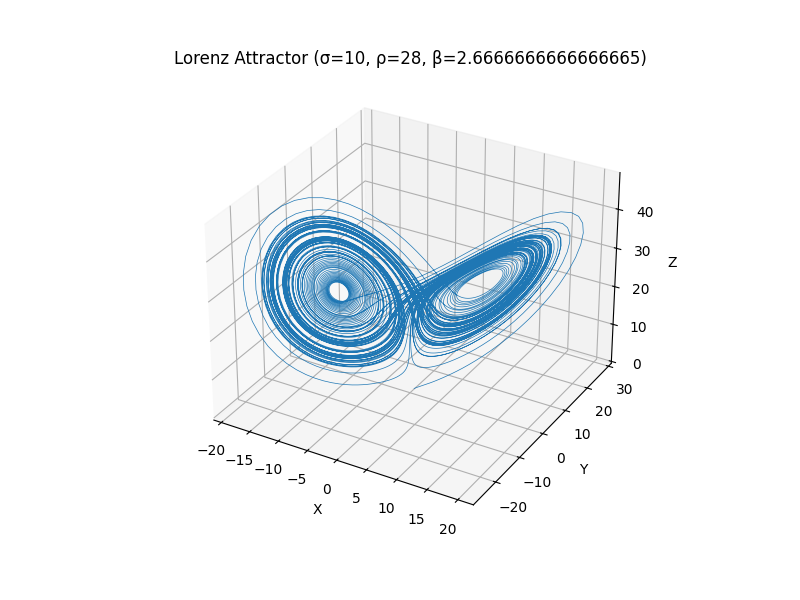

# Lorenz Attractor

## Overview

The Lorenz system, introduced by Edward Lorenz in 1963, is a set of three nonlinear differential equations originally developed to model atmospheric convection. It is one of the earliest known chaotic systems, demonstrating extreme sensitivity to initial conditions—an idea popularized as the butterfly effect. Small changes in input lead to vastly different outcomes, making long-term predictions impractical. This project implements the Lorenz system to explore its chaotic behavior.

The system's equations are as follows:

$$
\large
\begin{aligned}
\frac{dx}{dt} &= \sigma (y - x) \\
\\
\frac{dy}{dt} &= x (\rho - z) - y \\
\\
\frac{dz}{dt} &= x y - \beta z
\end{aligned}
\large
$$

Where:

x, y, z are the system's state variables,
σ (sigma), ρ (rho), and β (beta) are the system's parameters.
The Lorenz system is a simplified model for atmospheric convection and exhibits chaotic behavior for certain parameter values, making it one of the most famous examples of chaotic systems in physics and mathematics.

### Parameters  

- σ (sigma): The Prandtl number, which measures the ratio of momentum diffusivity to thermal diffusivity.  
- ρ (rho): The Rayleigh number, which controls the convection strength.  
- β (beta): The ratio of the system's physical dimensions.  

### How It Works

The Lorenz system is solved numerically using initial conditions and the specified parameter values. The system's chaotic behavior becomes apparent when small changes in initial conditions lead to drastically different outcomes over time. This property is often referred to as the butterfly effect.

### Numerical Solution  

The system of differential equations is solved numerically using a method like Runge-Kutta or odeint (in Python's scipy.integrate library), which computes the values of x, y, and z at each time step. By iterating over time, the behavior of the system is observed.